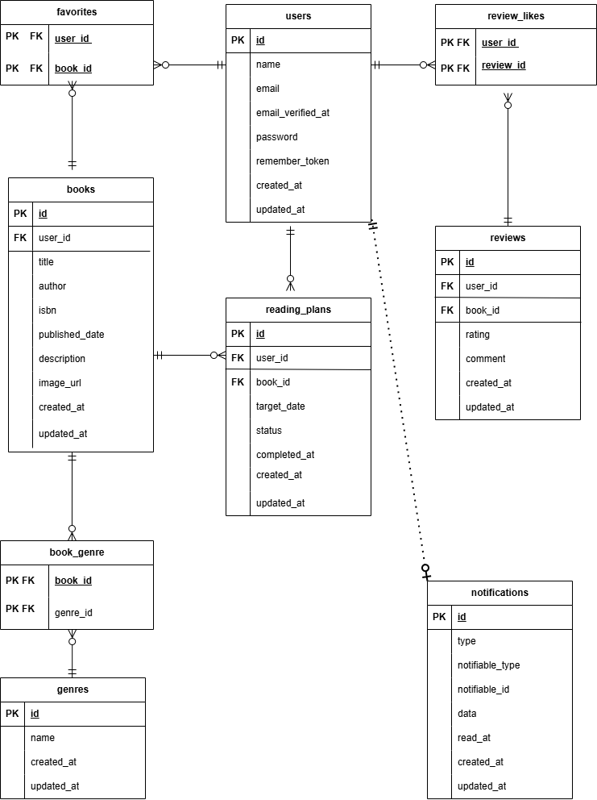

# Bookshelf App

Laravelを使用して開発した、書籍管理・レビューアプリケーションです。

ユーザーは会員登録・ログイン後、書籍の登録やレビュー投稿、お気に入り登録、読書計画の管理などを行えます。

応用機能として、Google Books APIを利用したISBN検索、読書計画の期限切れ通知、読書レポート、Laravel Sanctum認証を利用した公開APIを実装しています。

---

## アプリケーションURL

### アプリケーション

```text
http://localhost
```

### phpMyAdmin

```text
http://localhost:8080
```

---

## 主な機能

### 基本機能

- 会員登録
- ログイン・ログアウト
- 書籍一覧表示
- 書籍詳細表示
- 書籍登録
- 書籍編集
- 書籍削除
- キーワード検索
- ジャンルによる絞り込み
- 書籍の並び替え
- ジャンル一覧表示
- ジャンル詳細表示
- ジャンル登録
- ジャンル編集
- ジャンル削除
- レビュー投稿
- レビュー編集
- レビュー削除
- お気に入り登録・解除
- レビューへのいいね・解除
- レビュー平均評価ランキング
- 公開APIによる書籍一覧・詳細・登録・更新・削除

### 応用機能

- 読書計画の登録
- 読書計画の編集
- 読書計画の削除
- 読書開始処理
- 読了処理
- 読書計画の状態管理
- 期限切れ読書計画の自動更新
- 期限切れ通知
- 通知一覧表示
- 通知の既読処理
- マイ読書レポート
- Google Books APIを利用したISBN検索
- Laravel SanctumによるAPI認証
- APIにおける書籍所有者の認可
- 検索条件を維持したページネーション

---

## 読書計画のステータス

読書計画の状態は、PHP Enumを利用して管理しています。

| ステータス | 表示名 | 内容 |
| --- | --- | --- |
| `planned` | 未読 | 読書計画を登録した状態 |
| `reading` | 読書中 | 「読み始める」を実行した状態 |
| `completed` | 読了 | 読み終わった状態 |
| `expired` | 期限切れ | 期日を過ぎた状態 |

同一ユーザーと同一書籍の読書計画は、同時に1件のみ登録できます。

既存の読書計画を削除した場合は、同じ書籍について新しい読書計画を登録できます。

---

## 読書計画の操作条件

| 操作 | 実行可能な状態 |
| --- | --- |
| 読書開始 | 未読 |
| 期日編集 | 未読・読書中・期限切れ |
| 読了 | 未読・読書中・期限切れ |
| 削除 | すべての状態 |
| 再度の読了処理 | 不可 |

読了済みの読書計画は編集できません。

期限切れの読書計画を編集した場合は、ステータスを未読へ戻します。

---

## 読書レポート機能

- レビュー投稿数の表示
- 読了冊数の表示
- レビュー平均評価の表示
- 評価分布の表示
- 高評価書籍の表示
- ジャンル別評価傾向の表示
- Collectionメソッドによる集計処理

---

## 通知・バッチ処理

- 読書計画の期限通知
- データベース通知
- 通知一覧表示
- 通知の既読処理
- Laravel Schedulerによる日次処理
- 期限を過ぎた読書計画を期限切れへ自動変更
- 同一読書計画への期限切れ通知の重複防止

---

## ISBN検索機能

- ISBN-13による書籍検索
- Google Books APIとの連携
- 書籍タイトル・著者などの情報取得
- Laravel HTTP Clientを使用

---

## 公開API

- 書籍一覧取得
- 書籍詳細取得
- 書籍登録
- 書籍更新
- 書籍削除
- Laravel API ResourceによるJSONレスポンスの統一
- Laravel Sanctumによるトークン認証
- 所有者のみ書籍の更新・削除可能

---

## 提供テンプレートについて

本アプリケーションの画面デザインには、COACHTECHから提供されたBookShelf用Bladeテンプレートを使用しています。

基本機能の実装時には`basic`ブランチ、応用機能の実装時には`advanced`ブランチの`resources/`をプロジェクトへ移入しました。

### 提供元

```text
coachtech-prepared-file/Preparedblade-mockcase-BookShelf
```

バックエンド処理、データベース設計、バリデーション、認証・認可、API、テスト、および一部の画面機能は本プロジェクト内で実装しています。

完成済みの`resources/`は本リポジトリに含まれているため、環境構築時に提供元リポジトリから再度コピーする必要はありません。

---

## 使用技術

実際のバージョンは、以下のコマンドで確認できます。

```bash
./vendor/bin/sail php -v
./vendor/bin/sail artisan --version
```

| 項目 | 使用技術 |
| --- | --- |
| バックエンド | PHP 8.5.7 |
| フレームワーク | Laravel 10.50.2 |
| データベース | MySQL |
| 開発環境 | Docker / Laravel Sail |
| テンプレートエンジン | Blade |
| CSS | Tailwind CSS |
| JavaScript | Alpine.js |
| ビルドツール | Vite |
| Web認証 | Laravel Fortify |
| API認証 | Laravel Sanctum |
| 外部API | Google Books API |
| テスト | PHPUnit |
| コード整形 | Laravel Pint |
| データベース管理 | phpMyAdmin |

---

## ER図



---

## テーブル構成

本アプリケーションでは、主に以下のテーブルを使用しています。

| テーブル名 | 用途 |
| --- | --- |
| `users` | ユーザー情報 |
| `books` | 書籍情報 |
| `genres` | ジャンル情報 |
| `book_genre` | 書籍とジャンルの中間テーブル |
| `reviews` | レビュー情報 |
| `favorites` | お気に入り情報 |
| `review_likes` | レビューいいね情報 |
| `reading_plans` | 読書計画 |
| `notifications` | 通知情報 |
| `personal_access_tokens` | SanctumのAPIトークン |

### 主な一意制約

| テーブル | 制約 |
| --- | --- |
| `users` | `email` |
| `books` | `isbn` |
| `genres` | `name` |
| `reviews` | `user_id`と`book_id`の組み合わせ |
| `reading_plans` | `user_id`と`book_id`の組み合わせ |

### 複合主キー

| テーブル | 複合主キー |
| --- | --- |
| `book_genre` | `book_id`・`genre_id` |
| `favorites` | `user_id`・`book_id` |
| `review_likes` | `user_id`・`review_id` |

---

## 環境構築

## 1. リポジトリをクローン

任意のディレクトリで、以下のコマンドを実行します。

```bash
git clone https://github.com/rararamonkey/bookshelf-app.git
```

プロジェクトディレクトリへ移動します。

```bash
cd bookshelf-app
```

---

## 2. 環境変数ファイルを作成

`.env.example`をコピーして、`.env`ファイルを作成します。

```bash
cp .env.example .env
```

---

## 3. .envファイルを設定

### データベース設定

`.env`ファイルのデータベース設定が、以下の内容になっていることを確認してください。

```env
DB_CONNECTION=mysql
DB_HOST=mysql
DB_PORT=3306
DB_DATABASE=laravel
DB_USERNAME=sail
DB_PASSWORD=password
```

`DB_HOST`には、`localhost`や`127.0.0.1`ではなく、Dockerのサービス名である`mysql`を指定します。

### Google Books APIキーの設定

ISBN検索機能では、Google Books APIを使用しています。

アプリでISBN検索機能を利用するには、Google Books APIキーを`.env`ファイルへ設定してください。

```env
GOOGLE_BOOKS_API_KEY=取得したAPIキー
```

`.env.example`には、環境変数名のみ記載しています。

```env
GOOGLE_BOOKS_API_KEY=
```

本プロジェクトのテストでは`Http::fake()`を使用しているため、テスト実行時は実際のGoogle Books APIへ通信しません。

※ `.env`ファイルを変更したにもかかわらず設定が反映されない場合は、以下を実行してください。

```bash
./vendor/bin/sail artisan config:clear
```

---

## 4. PHP依存パッケージをインストール

Laravel Sailを起動する前に、Dockerを使用してComposerの依存パッケージをインストールします。

```bash
docker run --rm \
    -u "$(id -u):$(id -g)" \
    -v "$(pwd):/var/www/html" \
    -w /var/www/html \
    -e COMPOSER_CACHE_DIR=/tmp/composer_cache \
    laravelsail/php82-composer:latest \
    composer install
```

---

## 5. Laravel Sailを起動

```bash
./vendor/bin/sail up -d
```

コンテナが正常に起動していることを確認します。

```bash
./vendor/bin/sail ps
```

`.env`ファイルを追加または変更した場合は、設定キャッシュをクリアしてください。

```bash
./vendor/bin/sail artisan config:clear
```

---

## 6. アプリケーションキーを生成

```bash
./vendor/bin/sail artisan key:generate
```

---

## 7. フロントエンドの依存パッケージをインストール

```bash
./vendor/bin/sail npm install
```

---

## 8. データベースを作成し、初期データを登録

以下のコマンドでマイグレーションを実行し、Seederの初期データを登録します。

```bash
./vendor/bin/sail artisan migrate --seed
```

Seederには、書籍・レビュー・お気に入り・レビューいいねに加えて、期限切れ通知や読書計画の認可確認に必要なダミーデータも含まれています。

---

## 9. Vite開発サーバーを起動

```bash
./vendor/bin/sail npm run dev
```

このコマンドは終了せず待機状態になるため、ターミナルを開いたままにしてください。

以降のコマンドを実行する場合は、別のターミナルを開いて実行してください。

---

## 10. アプリケーションへアクセス

ブラウザで以下へアクセスします。

```text
http://localhost
```

---

# 動作確認

## ISBN検索

以下のテストユーザーでログインしてください。

**メールアドレス**

```text
test@example.com
```

**パスワード**

```text
password
```

ログイン後、「書籍登録」画面を開き、以下のISBNを入力して「ISBN検索」を実行してください。

```text
9784873115658
```

タイトル、著者名、出版日、説明、画像URLが自動入力されることを確認してください。

---

## PHPUnitテスト

本プロジェクトでは、PHPUnitを使用して各機能の動作を検証しています。

すべてのテストを実行する場合は、以下のコマンドを実行してください。

```bash
./vendor/bin/sail artisan test
```

すべてのテスト結果が**PASS**になることを確認してください。

特定のテストファイルのみ実行する場合は、以下のようにファイルを指定します。

```bash
./vendor/bin/sail artisan test tests/Feature/ReadingPlanTest.php
```

特定のテストのみ実行する場合は、`--filter`を使用します。

```bash
./vendor/bin/sail artisan test --filter=テストメソッド名
```

Google Books APIを利用するテストでは`Http::fake()`を使用しているため、テスト実行時は実際のGoogle Books APIへ通信しません。

## 開発環境URL

| サービス | URL |
| --- | --- |
| アプリケーション | `http://localhost` |
| phpMyAdmin | `http://localhost:8080` |

---

## テストユーザー

Seederを実行すると、以下のテストユーザーが登録されます。

| ユーザー名 | メールアドレス | パスワード |
| --- | --- | --- |
| 山田太郎 | `yamada@example.com` | `password` |
| 鈴木花子 | `suzuki@example.com` | `password` |
| 田中一郎 | `tanaka@example.com` | `password` |
| 佐藤美咲 | `sato@example.com` | `password` |
| 高橋健太 | `takahashi@example.com` | `password` |

すべてのテストユーザーで、共通パスワード`password`を使用しています。

---

## テスト

### すべてのテストを実行

すべてのテストを実行します。

```bash
./vendor/bin/sail artisan test
```

### テストカバレッジを確認

テストカバレッジを確認する場合は、以下を実行します。

```bash
./vendor/bin/sail artisan test --coverage
```

### 特定のテストクラスを実行

テストクラス名を`--filter`に指定します。

```bash
./vendor/bin/sail artisan test --filter=ReadingPlanTest
```

```bash
./vendor/bin/sail artisan test --filter=ApiBookTest
```

```bash
./vendor/bin/sail artisan test --filter=NotificationTest
```

### 特定のテストメソッドを実行

テストメソッド名を`--filter`に指定します。

```bash
./vendor/bin/sail artisan test --filter=test_owner_can_start_planned_reading_plan
```

### Feature Testを実行

```bash
./vendor/bin/sail artisan test tests/Feature
```

### Unit Testを実行

```bash
./vendor/bin/sail artisan test tests/Unit
```

### テスト実行前の確認

Laravel Sailが起動していることを確認します。

```bash
./vendor/bin/sail ps
```

起動していない場合は、以下を実行します。

```bash
./vendor/bin/sail up -d
```

データベースのテーブルや初期データを再構築する場合は、以下を実行します。

```bash
./vendor/bin/sail artisan migrate:fresh --seed
```

---

## テスト結果

- テスト数：197件
- アサーション数：487件
- テストカバレッジ：91.5%

基本機能および応用機能について、正常系・異常系・認証・認可を含むテストを実装しました。

基本機能・応用機能ともに、要件で定められたカバレッジ目標を達成しています。

| 対象 | 目標 |
| --- | --- |
| 基本機能 | 60％超 |
| 応用機能を含む全体 | 80％以上 |
| 実測値 | 91.5％ |

### 主なテスト対象

- 会員登録・ログイン・ログアウト
- 書籍CRUD
- 書籍検索・絞り込み・並び替え
- ジャンルCRUD
- レビューCRUD
- レビュー重複登録防止
- お気に入り
- レビューいいね
- ランキング
- 公開API
- Sanctum認証
- API認可
- ISBN検索
- 読書計画
- 通知
- Scheduler
- マイ読書レポート
- Policy
- モデルリレーション
- カスケード削除

---

## Scheduler・期限切れ通知

読書計画の期限切れ処理と通知処理には、Laravel Schedulerを利用しています。

毎日午前8時に、期限切れ読書計画の確認処理を実行します。

期限切れ処理の対象となるのは、以下の条件をすべて満たす読書計画です。

- ステータスが`planned`（未読）または`reading`（読書中）
- `target_date`が実行日より前の日付

期限当日の読書計画は、期限切れ処理の対象になりません。

処理対象となった読書計画は、以下のように更新されます。

- ステータスを`expired`（期限切れ）へ変更
- 読書計画の所有者にデータベース通知を作成

同一の読書計画に対する期限切れ通知は、1回のみ作成されます。

### 登録されているスケジュールの確認

以下のコマンドで、Schedulerに登録されている処理と実行時刻を確認できます。

```bash
./vendor/bin/sail artisan schedule:list
```

期限切れ通知処理が毎日午前8時に登録されていることを確認してください。

### ローカル環境でSchedulerを継続実行する方法

ローカル環境でSchedulerを継続的に動作させる場合は、以下のコマンドを実行します。

```bash
./vendor/bin/sail artisan schedule:work
```

このコマンドは終了せず待機状態になるため、実行中はターミナルを開いたままにしてください。

### 期限切れ通知を手動で確認する方法

採点時や開発時にSchedulerの実行時刻を待たず確認できるよう、以下のArtisanコマンドを用意しています。

```bash
./vendor/bin/sail artisan reading-plans:send-reminders
```

Seederには、期限切れ通知の確認に必要な読書計画が登録されています。

初期データを再構築します。

```bash
./vendor/bin/sail artisan migrate:fresh --seed
```

続けて、期限切れ通知コマンドを実行します。

```bash
./vendor/bin/sail artisan reading-plans:send-reminders
```

初回実行時は、以下の2件が処理対象になります。

- `planned`かつ期限切れの読書計画
- `reading`かつ期限切れの読書計画

期待される出力は以下です。

```text
2件の読書計画を確認しました。
```

処理後は、対象となった2件のステータスが`expired`へ変更され、所有者に通知が作成されます。

同じコマンドをもう一度実行します。

```bash
./vendor/bin/sail artisan reading-plans:send-reminders
```

対象の読書計画はすでに`expired`へ変更されているため、2回目は以下の出力になります。

```text
0件の読書計画を確認しました。
```

これにより、同じ読書計画について通知が繰り返し作成されないことを確認できます。

### 画面上での通知確認

1. 以下のテストユーザーでログインします。

```text
メールアドレス：yamada@example.com
パスワード：password
```

2. 通知一覧画面を開きます。
3. 期限切れ読書計画の通知が2件表示されることを確認します。
4. 通知の既読処理が実行できることを確認します。

### Schedulerを本番環境で動作させる場合

本番環境では、サーバーのCronなどからLaravel Schedulerを毎分実行する設定が必要です。

```cron
* * * * * cd /path-to-project && php artisan schedule:run >> /dev/null 2>&1
```

`/path-to-project`は、実際のプロジェクトディレクトリへ置き換えてください。

## API認証

書籍登録・更新・削除APIには、Laravel Sanctumによる認証が必要です。

### APIログイン

```http
POST /api/v1/login
```

### リクエスト例

```json
{
  "email": "yamada@example.com",
  "password": "password"
}
```

認証成功時にBearerトークンが発行されます。

以降の認証必須APIでは、HTTPヘッダーに以下を設定します。

```http
Authorization: Bearer {token}
Accept: application/json
```

---

## APIエンドポイント一覧

### 認証

| メソッド | エンドポイント | 概要 | 認証 |
| --- | --- | --- | --- |
| POST | `/api/v1/login` | ログイン・APIトークン発行 | 不要 |

### 書籍API

| メソッド | エンドポイント | 概要 | 認証 |
| --- | --- | --- | --- |
| GET | `/api/v1/books` | 書籍一覧取得 | 不要 |
| GET | `/api/v1/books/{book}` | 書籍詳細取得 | 不要 |
| POST | `/api/v1/books` | 書籍登録 | 必要 |
| PUT/PATCH | `/api/v1/books/{book}` | 書籍更新 | 必要 |
| DELETE | `/api/v1/books/{book}` | 書籍削除 | 必要 |

書き込み系APIでは、Laravel SanctumによるBearerトークン認証が必要です。

---

## 書籍一覧APIの検索パラメータ

```http
GET /api/v1/books
```

以下の検索パラメータを利用できます。

| パラメータ | 内容 |
| --- | --- |
| `keyword` | タイトルまたは著者名による検索 |
| `genre_id` | ジャンルIDによる絞り込み |
| `page` | ページ番号 |
| `per_page` | 1ページあたりの表示件数 |

### リクエスト例

```http
GET /api/v1/books?keyword=Laravel&genre_id=1&per_page=10
```

---

## APIステータスコード

| コード | 意味 | 使用する場面 |
| --- | --- | --- |
| `200 OK` | 処理成功 | 一覧取得・詳細取得・更新・ログイン |
| `201 Created` | 新規作成成功 | 書籍登録 |
| `204 No Content` | 処理成功・本文なし | 書籍削除 |
| `401 Unauthorized` | 未認証・認証失敗 | トークンなし・無効なトークン・ログイン失敗 |
| `403 Forbidden` | 認可エラー | 他人の書籍を更新・削除しようとした場合 |
| `404 Not Found` | 対象データなし | 存在しない書籍ID |
| `422 Unprocessable Entity` | バリデーションエラー | 入力値がルールを満たさない場合 |

---

## ISBN検索

書籍登録画面では、13桁のISBNを利用してGoogle Books APIから書籍情報を取得できます。

### 取得する情報

- タイトル
- 著者名
- 出版日
- 説明
- 画像URL

### エラー時の処理

| 状況 | ステータス |
| --- | --- |
| ISBNが13桁ではない | 422 |
| 該当書籍がない | 404 |
| Google Books APIとの通信に失敗 | 500 |

外部APIのテストには`Http::fake()`を利用し、実際の外部通信に依存しないテストを実装しています。

---

## コード整形

Laravel Pintを使用してPHPコードを自動整形します。

```bash
./vendor/bin/sail pint
```

コード整形が必要ない状態か確認する場合は、以下を実行します。

```bash
./vendor/bin/sail pint --test
```

`No fixable issues were found`と表示されれば、コード整形は完了しています。

---

## 工夫した点

### FormRequestによるバリデーションの分離

書籍、レビュー、ジャンル、読書計画、公開APIのバリデーションをFormRequestへ分離しました。

Controllerへ直接バリデーションルールを書かず、入力検証の責務をFormRequestへまとめています。

また、各FormRequestに`messages()`を実装し、日本語のエラーメッセージを定義しています。

### Policyによる認可

以下の操作について、所有者または投稿者本人のみ操作できるようにしました。

- 書籍の編集・削除
- レビューの編集・削除
- 読書計画の編集
- 読書計画の開始
- 読書計画の読了
- 読書計画の削除

Web画面だけでなく、APIの書籍更新・削除にも認可を適用しています。

### Enumによるステータス管理

読書計画の状態を`ReadingPlanStatus` Enumで管理しています。

`planned`や`completed`などの文字列を複数箇所へ直接記述することを避け、状態判定の統一性を高めています。

### API Resourceによるレスポンス整形

書籍一覧、書籍詳細、ジャンル、レビューのAPIレスポンスをAPI Resourceで整形しています。

一覧APIには以下を含めています。

- ジャンル
- 平均評価
- レビュー件数
- ページネーション情報

詳細APIには以下を含めています。

- 書籍情報
- ジャンル
- レビュー一覧
- レビュー投稿者名
- 平均評価
- レビュー件数

### Eager LoadingによるN+1問題への対応

書籍に紐づくジャンル、レビュー、レビュー投稿者などを取得する際は、`with()`や`load()`を使用しています。

一覧画面や詳細画面で関連データを繰り返し取得することを防ぎ、クエリ数を抑えています。

### データベース制約による重複防止

アプリケーション側の重複チェックに加えて、データベースにも一意制約や複合主キーを設定しています。

以下の重複を防止しています。

- 同じISBNの書籍
- 同じジャンル名
- 同じユーザーによる同じ書籍への複数レビュー
- 同じユーザーと書籍の読書計画
- 同じ書籍とジャンルの組み合わせ
- 同じユーザーと書籍のお気に入り
- 同じユーザーによる同じレビューへの複数いいね

### 認証ユーザーから登録者IDを取得

書籍登録APIでは、`user_id`をリクエストから受け取らず、Sanctumで認証されたユーザーのIDを登録者IDとして保存しています。

リクエストで他人のユーザーIDを指定されることを防止しています。

### 期限切れ通知の重複防止

読書計画が期限切れになった場合、所有者へ通知を作成します。

同じ読書計画に対する通知が複数回作成されないよう、既存通知を確認してから処理しています。

### 外部APIテストの安定化

Google Books APIのテストでは`Http::fake()`を使用しています。

実際の外部通信を行わず、取得成功・対象なし・通信失敗などのケースを安定して検証できるようにしました。

---

## ディレクトリ構成

```text
app
├── Actions
│   └── Fortify
├── Console
│   └── Commands
├── Enums
├── Http
│   ├── Controllers
│   │   └── Api
│   │       └── V1
│   ├── Requests
│   │   └── Api
│   │       └── V1
│   └── Resources
│       └── Api
│           └── V1
├── Models
├── Notifications
├── Policies
└── Providers

database
├── factories
├── migrations
└── seeders

resources
├── css
├── js
└── views
    ├── auth
    ├── books
    ├── components
    ├── favorites
    ├── genres
    ├── layouts
    ├── notifications
    ├── ranking
    ├── reading-plans
    ├── reports
    └── reviews

routes
├── api.php
└── web.php

tests
├── Feature
└── Unit
```

---

## 日本語化について

認証メッセージおよびバリデーションメッセージの日本語化には、`lang/ja`配下のメッセージファイルを使用しています。

`laravel-lang/*`系のパッケージは使用していません。

---

## セキュリティ対策

本アプリケーションでは、主に以下の対策を行っています。

- CSRF対策
- FormRequestによる入力値検証
- EloquentによるSQLインジェクション対策
- FortifyによるWeb認証
- SanctumによるAPI認証
- Policyによる認可
- パスワードのハッシュ化
- API登録時に`user_id`をリクエストから受け取らない設計
- データベース制約による重複登録防止

---

## 作成者

藤原

---

## ライセンス

本アプリケーションは、学習目的で作成したものです。
